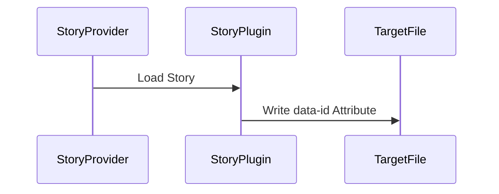
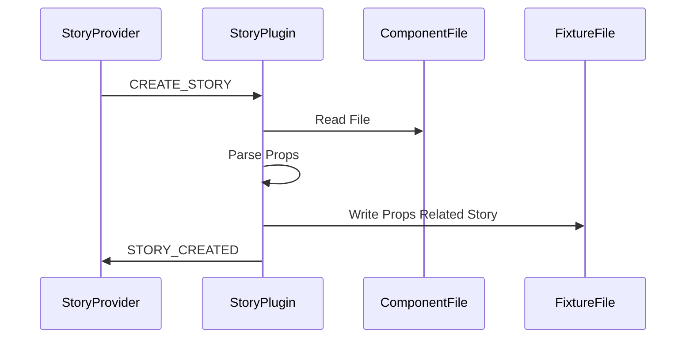
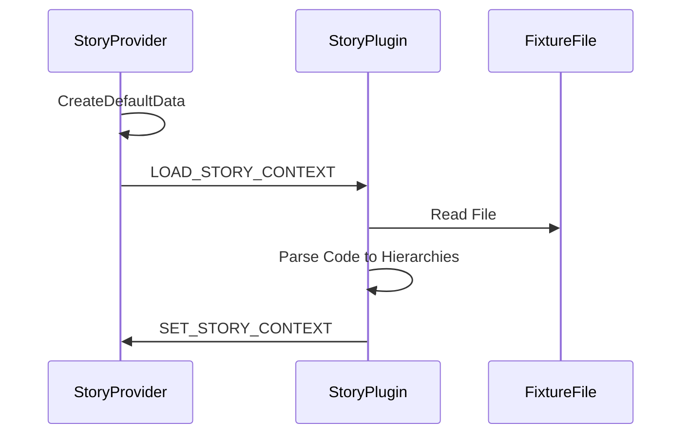
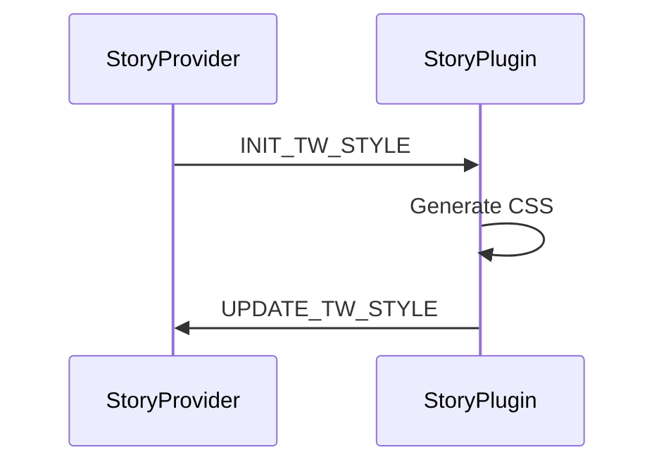
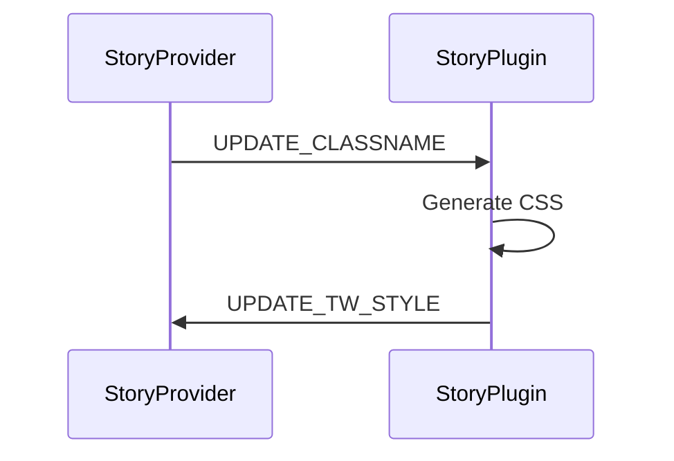
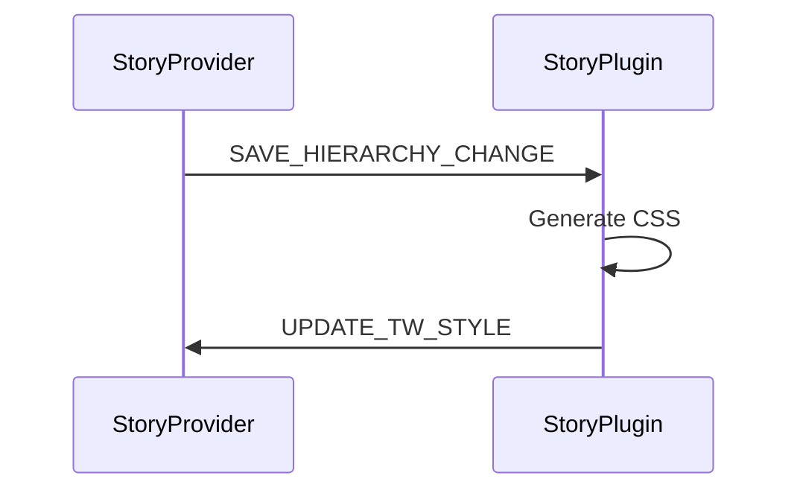

> Won't save manual data until user save changes to code

## Start up

```mermaid
sequenceDiagram
    participant StoryProvider
    participant StoryPlugin
    participant TargetFile
    StoryProvider ->> StoryPlugin : Load Story
    StoryPlugin ->> TargetFile : Write data-id Attribute
```

## Create Story

```mermaid
sequenceDiagram
    participant StoryProvider
    participant StoryPlugin
    participant ComponentFile
    participant FixtureFile
    StoryProvider ->> StoryPlugin : CREATE_STORY
    StoryPlugin ->> ComponentFile : Read File
    StoryPlugin ->> StoryPlugin: Parse Props
    StoryPlugin ->> FixtureFile: Write Props Related Story
    StoryPlugin ->> StoryProvider: STORY_CREATED
```

## Init Story Data

```mermaid
sequenceDiagram
    participant StoryProvider
    participant StoryPlugin
    participant FixtureFile
    StoryProvider ->> StoryProvider: CreateDefaultData
    StoryProvider ->> StoryPlugin : LOAD_STORY_CONTEXT
    StoryPlugin ->> FixtureFile: Read File
    StoryPlugin ->> StoryPlugin: Parse Code to Hierarchies
    StoryPlugin ->> StoryProvider : SET_STORY_CONTEXT
```

## Init Tailwindcss Style

```mermaid
sequenceDiagram
    participant StoryProvider
    participant StoryPlugin
    StoryProvider ->> StoryPlugin: INIT_TW_STYLE
    StoryPlugin ->> StoryPlugin: Generate CSS
    StoryPlugin ->> StoryProvider: UPDATE_TW_STYLE
```

## Update Classname

```mermaid
sequenceDiagram
    participant StoryProvider
    participant StoryPlugin
    StoryProvider ->> StoryPlugin: UPDATE_CLASSNAME
    StoryPlugin ->> StoryPlugin: Generate CSS
    StoryPlugin ->> StoryProvider: UPDATE_TW_STYLE
```

## Save Changes

```mermaid
sequenceDiagram
    participant StoryProvider
    participant StoryPlugin
    StoryProvider ->> StoryPlugin: SAVE_HIERARCHY_CHANGE
    StoryPlugin ->> StoryPlugin: Generate CSS
    StoryPlugin ->> StoryProvider: UPDATE_TW_STYLE
```
